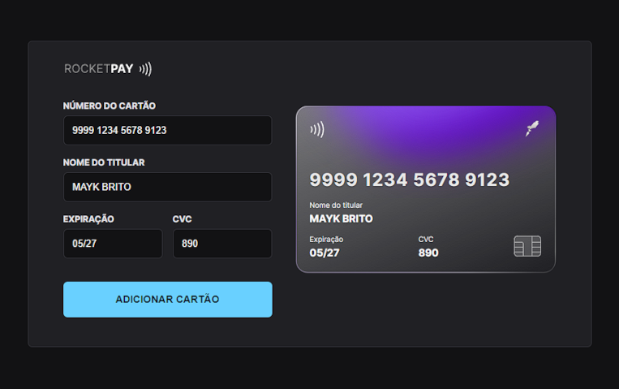

<h1 align="center"> RocketPay | Explorer Lab #01</h1>

Evento exclusivo e gratuito, promovido pela Rocketseat para ensino de tecnologias WEB.
Neste projeto foi abordado manipulação da DOM através do JavaScript, mascaramento dos campos de data, cvc e do cartão, utilizando RegEx (expressões regulares) para identificar a bandeira do emissor através da numeração BIN do cartão. Também apliquei um modal para apresentar as mensagens da aplicação e uma animação tilt no cartão.

  <a href="#-deploy">Deploy</a>&nbsp;&nbsp;&nbsp;|&nbsp;&nbsp;&nbsp;
  <a href="#-tecnologias">Tecnologias</a>&nbsp;&nbsp;&nbsp;|&nbsp;&nbsp;&nbsp;
  <a href="#-projeto">Projeto</a>&nbsp;&nbsp;&nbsp;|&nbsp;&nbsp;&nbsp;
  <a href="#-layout">Layout</a>&nbsp;&nbsp;&nbsp;|&nbsp;&nbsp;&nbsp;
  <a href="#memo-licença">Licença</a>

  

 

  

## 🚀 Deploy

O projeto está hospedado na Vercel e pode ser acessado através do link [rocketpay-kohl.vercel.app](http://rocketpay-kohl.vercel.app/).

## 🦾 Tecnologias

Esse projeto foi desenvolvido com as seguintes tecnologias:

- HTML e CSS
- JavaScript e JSON
- [Node e NPM](https://nodejs.org/)
- [Vite](https://vitejs.dev/)
- [iMask](https://imask.js.org)
- [Vanilla-tilt.js](https://micku7zu.github.io/vanilla-tilt.js/index.html)

## 💻 Projeto

O Rocketpay é um componente que simula o formulário de preenchimento de cartão de crédito, onde é possível adicionar máscara aos inputs e atualizar elementos HTML via DOM.

## 🔖 Layout

Você pode visualizar o layout Figma criado para esse projeto através [DESSE LINK](<https://www.figma.com/file/pq7i8f2PGzkpBEqOyf1SuD/Explorer-Lab-%2301-(Copy)?node-id=0%3A1&viewer=1>).

## :memo: Licença

Esse projeto está sob a licença MIT.

---

Feito com ♥ by [Dam450](https://github.com/dam450/)
e pela comunidade Rocketseat :wave: [Participe da comunidade!](https://discord.gg/rocketseat)
